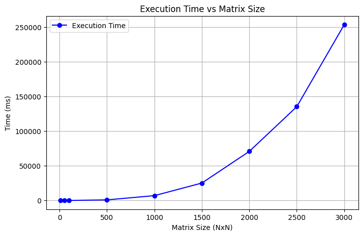

# Отчет по лабораторной работе №1

## Задание

В данной лабораторной работе необходимо было написать программу на языке C/C++ для перемножения двух матриц.

*Исходные данные:* файл(ы) содержащие значения исходных матриц.

*Выходные данные:* файл со значениями результирующей матрицы, время
выполнения, объем задачи.

Обязательна автоматизированная верификация результатов вычислений с помощью
сторонних библиотек или стороннего ПО (например на Matlab/Python).

## Описание работы

1. Были сгенерированы квадратные матрицы размером 10, 50, 100, 500, 1000, 1500, 2000, 2500, 3000;

2. Эти матрицы записываны в файлы matrixA(size).txt и matrixB(size).txt, расположенные в папке output;

3. Выполнено их перемножение на C++. Результаты сохранены в result_matrix(size).txt, расположенные также в папке output;

4. Фиксировано время выполнения операций и записано в report.txt (расположен в папке output);

5. Выполнена проверка на корректность результата с помощью Python путем сравнивания его с вычисленным с помощью NumPy значением. Результат проверки также записан в report.txt.

## Результаты работы

| Размер матрицы | Время выполнения (мс) |
| -------------- | --------------------- |
| 10             | 0                     |
| 50             | 1                     |
| 100            | 7                     |
| 500            | 838                   |
| 1000           | 6935                  |
| 1500           | 25084                 |
| 2000           | 70718                 |
| 2500           | 135082                |
| 3000           | 253163                |

Сравнение результатов умножения матриц: Для матриц всех размеров результаты C++ совпадают с NumPy, что подтверждает корректность вычислений.

### График зависимости времени выполнения умножения от размера матрицы:

## Вывод

График наглядно показывает, что время выполнения умножения матриц увеличивается при росте их размера. На небольших матрицах вычисления проходят быстро, но после 1000×1000 время начинает резко увеличиваться. Для больших размеров (от 2000×2000 и выше) оно возрастает очень сильно.
